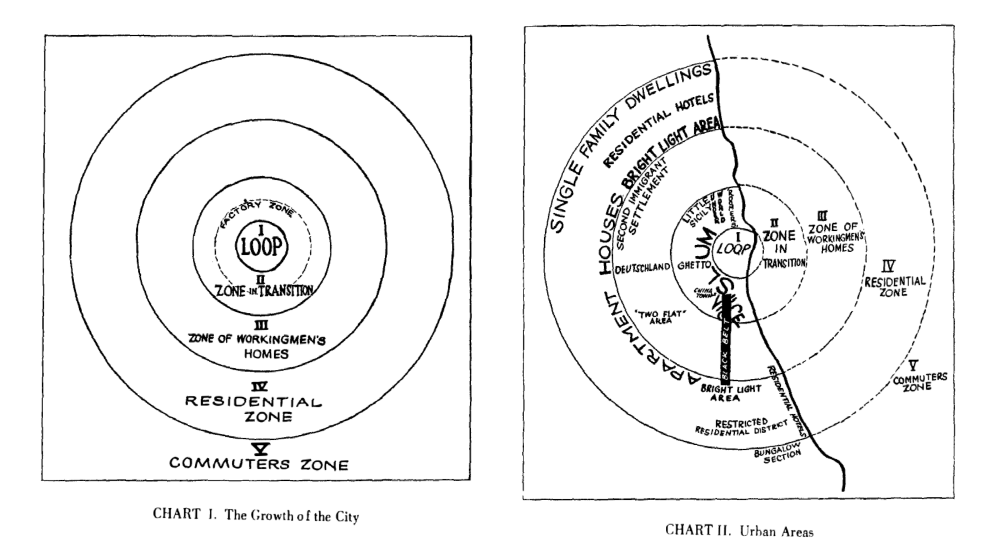

# Introduction

We are still only in the early days of a digital revolution that has
already begun to transform every aspect of human life, and will
continue to do so in ways that can hardly yet be imagined, let alone
quantifiably predicted [@MBatty2021].  Paradoxically, one of the most
powerful drivers of this general trend of unpredictable change is the
increasing power of sophisticated algorithmic technologies to extract
specific predictive insights concerning some sufficiently well-defined
question [@SRussellNorvig2016; @SOpenshawOpenshaw1977]. In a powerful
feedback loop, the more complex our contemporary social context becomes,
the more necessary become those tools which enable informed
decision-making amid an unprecedented deluge of (potentially) relevant
data [@RKitchin2014]. As the global population approaches ten
billion -- ten times what it was in the time of @TMalthus1798 --
one thing that can therefore be said with reasonable certainty is that
the significance of software will continue to increase
[@MAndreessen2011].

Yet while human culture is forced to accelerate at the pace of
an agile software development sprint [@JShoreWarden2007], human
biology remains essentially the same as it has been since prehistoric
times. On the one hand, the Internet has made it possible for the larger
part of the global population to form a single virtual networked
community [@HYangEtAl2021] of which the value arguably scales like
$O(n^2)$, as suggested by Metcalfe's Law [@XZhangEtAl2015;
@TPeterson2018]. On the other hand, we remain physical creatures
constrained by geographical location; and instead of an eschatological
*end of geography*, it seems that technology has instead amplified the
significance of geospatially situated place [@SGraham1998].

And of all the significant types of place which we might want to
understand, the *neighbourhood* one of the most important. If we define
a neighbourhood as a place where a set of people live, then we can say,
as a trivial logical corollary, that everyone lives in a neighbourhood.
The ubiquitous relevance of such a term thus provides strong motivation
for pursuing its study. The application of machine learning to the field
of neighbourhood research is known as *geodemographics*
[@RHarrisEtAl2005; @RWebberBurrows2018].


{#fig:oac_fig}


```{.table caption="An Example of Geodemographic Cluster Description:\newline Groups and Subgroups from the 2011 OAC, created by @CGaleEtAl2016 {#tbl:oac_tbl}"
source="../csv/oac2011_.csv"}
```

Geodemographic analysis applies unsupervised cluster analysis to the
demographic data associated with geographic areas, thus enabling the
reduction of the complex multidimensional reality of human society to a
more manageable number of statistical types. Having been identified
algorithmically, these statistical clusters can then be described
qualitatively (@Tbl:oac_tbl) and presented visually (@Fig:oac_fig),
creating products that have been used with great success for
highlighting communities for service delivery, both in commercial
marketing [@BLeventhal2016a] and in the public sector [@PLongley2005].
The specific example shown is the 2011 Open Area Classification created
by @CGaleEtAl2016, and visualized by @OOBrienCheshire2016.

However, although it has been seen widespread adoption as a
technique, there remain unresolved questions concerning its primary
object, the neighbourhood unit [@APetrovicEtAl2020]. Rather than
reflecting a meaningful theoretically-grounded understanding of
neighbourhood ontology, the units of geodemographic analysis are too
often defined merely by data availability; or at a deeper level, by the
administrative pragmatism and historical contigency responsible for
defining the boundaries of data collection units. As well as this
ontological critique, geodemographic analysis has also been the subject
of ethical critique, in which it has been portrayed as a prime example
[@JGoss1995; @CDaltonThatcher2015] of what has since been described as
*surveillance capitalism* [@SZuboff2015; -@SZuboff2019]. But while this
may apply to proprietary systems, the criticism cannot be reasonably
applied to open-source geodemographic analysis -- indeed, developing
such alternatives is arguably a necessary strategy for resisting
encroaching geosurveillance [@DSwanlundSchuurman2019].

The aim of this paper is therefore to establish a more robust foundation
for geodemographic analysis, by attempting to identify a theoretically
rigorous unit of neighbourhood analysis, thus addressing the ontological
critique; and to do so using open data and open-source software, thus
resisting the ethical critique.

# Literature Review

## 'Geodemographics': Development and Debate

The word 'geodemographics' was coined by Jonathan @JRobbin1980 to
describe the marketing tool his company had developed
[@RWebberBurrows2018, p.94]. By classifying American residential zip
codes into groups with similar demographic characteristics, and then
giving each group a memorable label and summary description, he had
created a product designed to simplify the process of targeting
prospective customers and selecting promising retail locations
[@JDeReuRobbin1981]. Robbin's tool combined the latest in marketing
theory with cutting-edge methods in quantitative geographic sociology. 

*Market segmentation* [@WSmith1956] solved the problem of a complex
market of heterogenous customers by dividing it into several sub-markets
of homogenous customers. *Demographics* -- that is, population
attributes such as age, sex, income, and ethnicity -- offer
a straightforward way of applying this strategy. The idea of
*psychographics* [@WWells1975] is then to understand the psychology of
a typical customer from a given market segment, so as to anticipate
their needs, desires, and trigger points. Robbin added these techniques
to the *social area analysis* [@EShevkyBell1955] he had been applying as
a doctoral candidate at New York University [@Ricercar2021], assisting
Edgar Borgatta in researching ways of classifying the social
characteristics of American cities [@JHaddenBorgatta1965].

@EShevkyBell1955 offered a method of classifying a census tract by
reducing the attributes of its census data into a simplied expression of
just three factors, which they suggested both retained the important
details of the data, and corresponded to the essential nature of
contemporary society. Each datapoint could then be visualized by a small
circle in a two-dimensional scatter-plot, with the attributes along the
x and y axes corresponding to the two more significant factors, and the
circle's colour the third. The datapoints can then be divided up
according to their position, and since their positional proximity is
a function of their statistical similarity, census tracts with
datapoints in the same segment can be considered as being of the same
*type*.

@RTryon1968 achieved a more sophisticated way of grouping census tract
datapoints, showing how his *cluster analysis* [@RTryon1939] could
identify 'clusters' of similar datapoints, avoiding the arbitrariness of
simply segmenting the attribute space by intervals. Instead these could
be detected by an iterative computational algorithm, made available in
reproducible FORTRAN code [@RTryonBailey1966]. From a contemporary
perspective, cluster analysis is a primary example of unsupervised
machine learning [@AGeron2019], thus making geodemographic analysis one
of the first, and arguably even the original, application of
unsupervised machine learning.

While clustering census tracts provides a way of segmenting them into
similar groups, the *ecological fallacy* [@WRobinson1950] means it does
not follow that individuals within tracts with similar population
demographics are necessarily similar at the individual level. The
argument for the likely homogeneity of census tract units is made by
reference to the account of the *neighbourhood* as a *natural area*
given by @RPark1925, who argued that the twin forces of homophily and
social influence will tend to segregate an urban population into
a "mosaic of social worlds" [@LWirth1938]. Park was the central figure
of the *Chicago School* [@AAbbott2017], whose distinctive *human
ecology* combined the empirical investigation exemplified by @CBooth1904
with the more theoretical sociology of @GSimmel1908, with whom he had
studied in Germany.

This account of geodemographic historiography is expressed in detail in
the collaborative monographs of @RHarrisEtAl2005 and
@RWebberBurrows2018. Booth's urban poverty maps offer "the first example
of applied geodemographics" [@RHarrisEtAl2005, p.30], the Chicago
School's theory of urban *natural areas* (@Fig:BurgessDiagrams) provides
the necessary "conceptual definition...[for] neighbourhood analysis"
[p.39], the increasing availability of census data then stimulates the
development of quantitative social area analysis and subsequent
factorial ecology [pp.39-40], paving the way for the emergence of
geodemographic products [p.55].

{#fig:BurgessDiagrams}

While Robbin coined the term 'geodemographics' and successfully turned
it into a profitable commercial product, his impact on the academic
understanding of neighbourhoods was quite limited. He dropped out of his
PhD without completing it, after his supervisor left to take up a post
at another university [@Ricercar2021], and it has subsequently been the
case in North America that, as a method for studying neighbourhood
dynamics and effects, "many academic social scientists ignore
geodemographics" [@MReibel2011, p.310].

In Britain however, the situation is quite different, largely because of
the different circumstances of its separate development by Richard
Webber. Independently from Robbin, Webber was also applying cluster
analysis to census data; first, for the purpose of helping the Liverpool
City Council identify priority areas for social service provision
[-@RWebber1975], and then on a national scale [-@RWebber1977,
-@RWebber1978]. Although Webber did go on to work in the marketing
industry, the initial context of his research for a public authority
meant that his work was published openly, rather than being
a proprietary secret. There has then been a continued tradition of free,
national, *open* [@ASingletonEtAl2016] geodemographic typologies of
Britain, produced using the data from the 1981 [@MCharltonEtAl1985],
1991 [@MBlakeOpenshaw1994], 2001 [@DVickersRees2007], and 2011
[@CGale2014; @CGaleEtAl2016] censuses. 

This has allowed robust academic debate about the validity and utility
of geodemographic typologies. @SOpenshawGillard1978 showed the
instability of clustered classifications by demonstrating their
sensitivity to subjective decisions at multiple points in their
construction, including "the selection of variables, the choice of
algorithms and methods, and various data management operations" (p.101),
and concluded that such classifications in general, and Webber's 1975
study in particular, "should not be used until they can be replicated at
the individual level" (p.118). @SOpenshawEtAl1980 repeated the warning
"for all users to be aware of the practical limitations of [Webber's
subsequent national] Classifications... [as] they are unsuitable or many
of the applications that have been suggested" (p.438). Webber apparently
was apparently unaware of the first critique, but the second quickly 
provoked a thorough rebuttal, in which @RWebber1980 concluded that the
critics were not "in touch with either public policy or the commercial
world" (p.449). Presumably, the point was well taken, as @SOpenshaw1985
then applied census-data cluster classification to rural areas,
complaining of the resistance of government departments to such methods,
and of their "preference for old fashioned pre-computer age techniques"
(p.286). 

@SOpenshaw1997 then found himself in another notable controversy
concerning geodemographics, this time offering a defense, when he
offered a widely-ranging response to the various criticisms of
Geographic Information Systems gathered by @JPickles1995. The point
which stands out as having the most continued validity in his discussion
is his suggestion that "data protection legislation" can mitigate some
of the dangers of unfettered technological surveillance, foreseeing the
need for the sort of data protection legislation now established by
statutes such as @GDPR2016.  

In our contemporary context, @SGilbert2021 offers another helpful
response to the suggestion that gathering and profiting from people's
data is a sort of exploitative 'data colonialism' [@JThatcherEtAl2016],
in which an intrinsically valuable resource is being unfairly extracted.
Rather than being 'the new oil' [@MSzczepanski2020], Gilbert, whose
describes himself as a 'data optimist', suggests that a better metaphor
for big data would in fact be 'the new manure': "a mundane by-product of
life" [p.36], which, like manure that is processed into fertiliser, only
has economic value because there are businesses that have invested in
processing it into something useful.  

We cannot in this paper attempt a comprehensive evaluation of Gilbert's
attempt to defend big data analytics and develop a positive account of
*digital legitimacy* [@AGreeneGilbert2020]. For our present purposes it
will suffice to note that on the one hand, a positive argument can be
made for it, while on the other hand, to whatever extent the negative
assessment is considered valid, the development of free and open
alternatives would seem to be a necessary strategy of resistance
[@DSwanlundSchuurman2019].  But regarding the ontological question of
how to define a neighbourhood, more must be said.

## Defining Neighbourhoods: Problems and Possibilities

One possible response to the question would be to suggest that in fact
the problem of neighbourhood definition is nothing more than a
particular instance of the the more general *Modifiable Areal Unit
Problem* (MAUP), described with typical clarity by @SOpenshaw1983, but in fact
identified fifty years previously by @CGehlkeBiehl1934. The problem is a
profound one for quantitative analysis involving spatial data, for it
observes that the same basic dataset can yield quite different
statistical results depending on the specific ways that its spatial data
has been aggregated. The effect is found not only when data is gathered
at different scales, but even when it is aggregated at the same scale
with differing boundaries. A contemporary example is shown in @Fig:covid_maup,
in which @ASingletonCheshire2021 demonstrate how, depending on the size
of the population of the areal unit used for analysis, COVID-19 rates
can appear "as low as 295 per 100,000 people or as high as 736 per
100,000". 

{#fig:covid_maup}

A slightly different challenge to quantitative spatial analysis is the
*Uncertain Geographic Context Problem* (UGCoP) described by @MKwan2012a.
The MAUP is a problem of how to aggregate individual datapoints into
collective units. It observes that different ways of aggregating
spatially located datapoints into broader areal units may lead to
different statistical conclusions, and therefore warns against treating
any particular areal unit as authoritative. The UGCoP, however, points
out that even when only considering a single social datapoint, that
point is associated with a human individual who will have experienced
exposure to relevant contextual influences in a variety of geographical
contexts not limited to the point at which they live, or perhaps were
interviewed, the details of which will in general be unknown to the 
researcher. But rather than merely confounding the issue further, Kwan
the problem in such a way as to suggest that there is in fact some "true
causally relevant geographic context" (p.959).

For Kwan, this suggests a turn "from location to movement, from place to
mobility, and from space to space-time" (p.966), and she suggests "using
GPS data to delineate activity spaces (p.965). This is all very well,
but in heeding her suggestion we might perhaps stray too far from our
own topic of geodemographic ontology.  But nevertheless, the suggestion
that for every spatial effect, there must be *some* true causally
relevant geographic context, rekindles the hope that even in considering
a general typology of residential neighbourhoods, such a causual context
might be found.

What then are the causally relevant contextual elements that make a
neighbourhood a neighbourhood? We find ourselves returning to the
observation made by @RPark1925 [p.1], that "there are forces at work...
within the limits of any natural area of human habitation... which tend
to bring about an orderly and typical grouping of its population and
institutions". Does Park's claim still hold? And if so, with which "forces"
should we be primarily concerned? Is it "the economic organization of the
city... based on the division of labour" (p.2)? Or rather "racial,
cultural and vocational interests" (p.11)? Or "the breaking down of
local attachments and the weakening of the restraints and inhibitions of
the primary [family] group, under the influence of the urban
environment" (p.25)? Or it is indeed the economic expansion of the city,
and the accompanying "tendency of each inner zone to extend its area by
the invasion of the next outer zone" [@EBurgess1925 p.51;
@Fig:BurgessDiagrams]? 

An impressive case is made by @GGalster2019 that "to understand the
causes and effects of neighborhoods one must embed them in a framework
in which four spatial levels--metropolitan, local jurisdiction,
neighbourhood, and individual--are interconnected in mutually causal
ways" (@Fig:model). At the individual level, we have the mobility and
investment behaviours of individual households, dwelling owners and
developers.  These both influence and are influenced by the demographic,
social, economic and physical characteristics of the household's
surrounding neighbourhood. Simultaneously, these neighbourhood
characteristics are engaged in circular interaction with public and
private service providers operating at a broader geographic scale. And
all of this occurs within the context of the regional housing market.

{#fig:model}

Galster grounds his model on the authority of @GSuttles1972, whose
"groundbreaking observation that people are cognitive of four distinct
spatial levels of neighbourhood" (p.39). At Suttles' time of writing,
the 'natural area' concept of Park, Burgess, and the interwar Chicago
School, had fallen thoroughly out of fashion. @MAlihan1938 had concluded
that although "the ecological school [was] one of the most definite and
influential schools in American sociology" (p.xi), "the concept 'natural
area', so fundamental to human ecology, has not as yet been consistently
defined and logically classified... [and] no amount of empirical
investigation can rectify the inconsistencies inherent in the
theoretical statements pertaining to it" (p.240). Refusing to accept
Alihan's damning verdict, @GSuttles1972 [p.21] attempted "to resurrect the
concept... and show that it may still be usefully applied to urban
areas", noting the need to consider both the "physical structure
of the city", and "the cognitive map which residents have".

Drawing on the suggestion that we can draw analogies between human
social behaviour and the ideas of animal *territoriality* developed by
zoologists such as @MLipitz1969 and @DMorris1967a, @GSuttles1972 suggests
that neighbourhood community "is best conceived of as a pyramid of
progressively more inclusive groupings" (p.45), and identifies four
relevant levels of analysis: the 'face-block', the 'defended
neighbourhood', the 'community of limited liability', and the 'expanded
community of limited liability'. At the smallest level, the
*face-block* "is the smallest discrete areal unit other than the
household which [residents] can point to" (p.56). Suttles takes for
granted that his readers will understand what a 'face-block' is, but
confuses matters somewhat by introducing the concept together with the
loose local network of acquaintances selected "because they are known
from shared conditions of residence" (p.55). In an otherwise excellent
review of the literature, @RChaskin1997 incorrectly identifies Suttles'
definitions of 'local network' and 'face-block', and suggests that a
face-block has no precise residential identification. But in fact
Suttles notes that unlike the loose network which is "unlikely to have
any sharp boundaries" (p.55), the face-block is notable specifically for
having an areal basis so clear that parents are able to use it for
instructing their children (p.56). For an explicitly articulated
definition, we must turn to @RGrannis2009 (p.31), who explains
(consistently with Suttles' usage) that "the face block includes all of
the dwellings that front on the same street and are situated between the
first cross streets, of any type, encountered in both directions away
from the respondent's house".

The face-block is of particular interest to us, because it offers a unit
of analysis that is primary from both the perspectives necessary to a
robust neighbourhood ontology, both that of physical structure and of
cognitive mapping. In the last decade the explosion of ubiquitous urban
data [@DArribas-Bel2014] has catalyzed significant advances in the
morphological analysis of urban physical structure, with the studies of
@MBarthelemy2017, @RLoufBarthelemy2014, @PSchirmerAxhausen2016,
@GBoeing2019 -@GBoeing2020a, and @MFleischmannEtAl2020b of particular
note. But with regard to the latter point of cognitive social maps,
although the essential ideas have been well-established since the
studies of @PGouldWhite1974 and @KLynch1960, there remains more work to
be done in integrating these concepts into large-scale analyses that
take advantage of the detailed data now available. The attempt of
@JLaiEtAl2020 to profile urban places based on geotagged Twitter data
for London suggests one possible direction of enquiry. But if we can
show more generally that there are strong theoretical reasons for the
significance of the face-block, then we can use the analytic tools
already developed for morphological analysis and claim them for more
social cognitive investigation as well.

@RGrannis2009 


```{.table caption="Levels of Relational Availability, [after @RGrannis2009] {#tbl:relational}"
source="../csv/neighbouring.csv"}
```


# Methodology

## Computational Setup: Free Open-Source Software and Open Data

## Data Exploration: Geography and Geometry

```{.table caption="GeoJSON Geometry Objects {#tbl:geojson}"
source="../csv/geojson.csv"}
```

```{.table caption="Some Coordinate Reference Systems {#tbl:crs}"
source="../csv/crs.csv"}
```

## Conceptual Definition: Metric Spaces, Walkable Graphs, and Topological Neighbourhoods

# Results

## Boundary Units: Tiles, Pixels, and Cells

## Neighbourhoods: Residential Face-Blocks and Connected Communities

## Implementation: Embarrassing Parallelization

# Discussion

# Conclusion

# References
